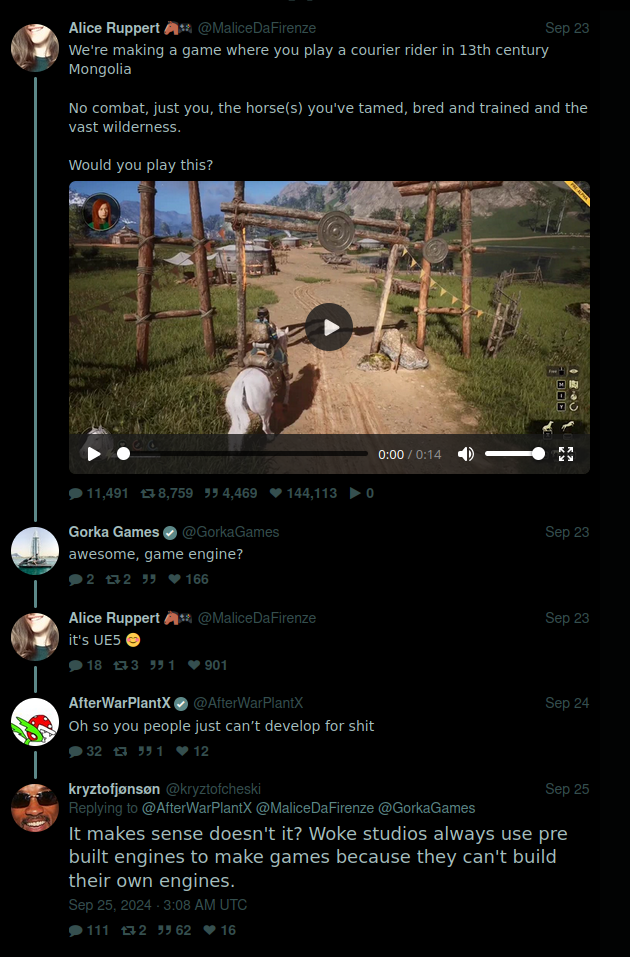
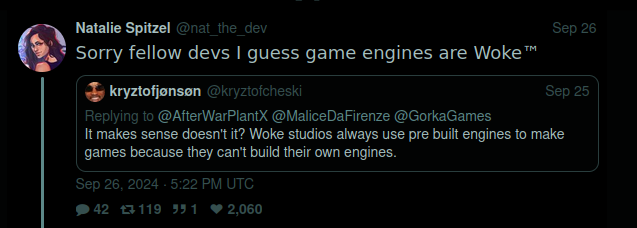
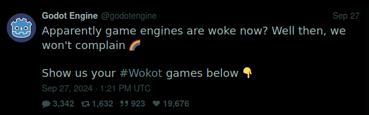
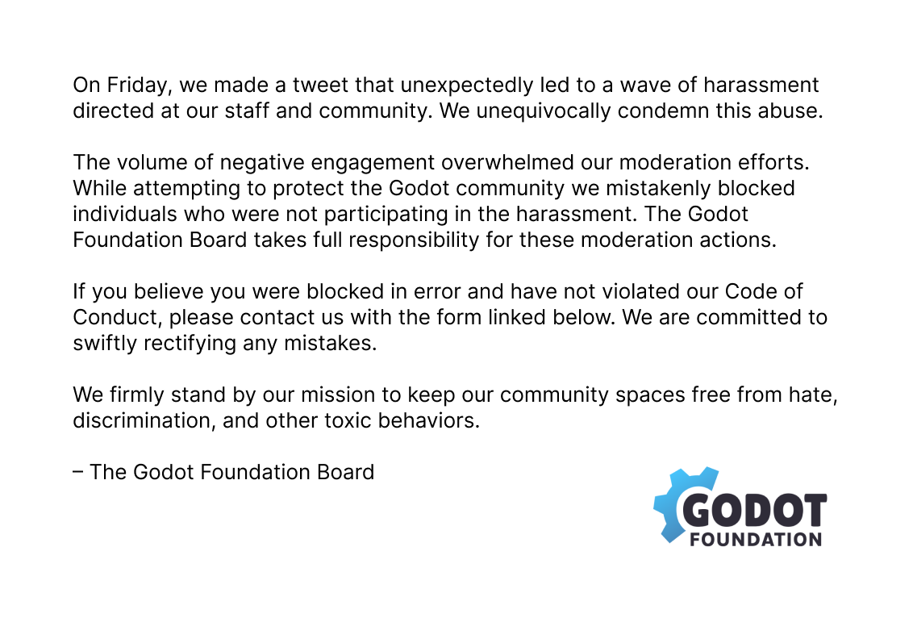
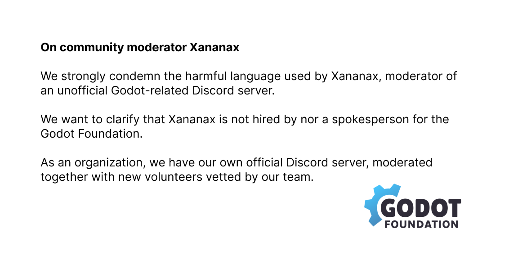

# Ce qui s'est passé avec la polémique Wokot

Vous avez entendu dire qu'il ne fallait plus utiliser Godot car le moteur était ~~~Woke~~~ ?
Vous avez entendu dire que de nombreux forks du projet étaient apparus ?
Vous avez entendu dire qu'il y avait eu une *shitstorm* sur Twitter ?
Vous avez entendu dire que la communauté Godot a banni de nombreux utilisateurs sur Twitter et Github ?

Et vous n'y comprenez rien ? 

**On fait le point ensemble !**

## À l'origine : un tweet stupid

Tout démarre le 24 septembre 2024, lorsqu'une dev indépendante *Alice Ruppert* poste une vidéo du jeu qu'elle développe : *Windstorm : The Legend Of Khiimori*. Suite à ce premier tweet, un utilisateur lui demande quel moteur elle utilise, ce à quoi elle répond qu'elle utilise l'Unreal Engine 5. Un autre utilisateur, feint la surprise en disant "Oh so you people just can't develop for shit" [Oh, donc vous savez pas développer.]. S'en suit un commentaire d'un autre utilisateur, "It makes sense doesn't it? Woke studios always use pre built engines to make games because they can't build their own engines." [Ça fait sens non ? Les studios wokes utilisent toujours des moteurs déjà faits pour fabriquer leurs jeux parce qu'ils ne sont pas capables de faire leur propres moteurs.]. Malheureusement, il ne s'agit pas d'un commentaire ironique, mais bien de premier degré.

## La moquerie qui dérape

Ce tweet circule rapidement et est repris le 26 septembre par Natalie Spitzel qui s'en moque allègrement "Sorry fellow devs I guess game engines are Woke (tm)" [Désolé les collègues devs, il semblerait que les moteurs de jeu soient Woke (tm)].

La community manager de Godot reprend le tweet le 27 septembre, et en profite pour faire de la pub pour le moteur et les jeux qui en découlent [ndlr: C'est son métier]: "Apparently game engines are woke now ? Well then, we won't complain. Show us your #wokot games below". [Apparemment les moteurs de jeux sont woke ? On va pas s'en plaindre. Montrez nous vos jeux #wokot en dessous]. 

## Ça dégénère

S'en suit près d'une semaine de cyber-harcèlement sur le compte officiel de Godot. Le 3 octobre, le tweet compte 3342 réponses, 1632 retweets et 923 quote tweets. Nombreux de ces tweets sont des tweets aggressifs, du [dogpiling](https://fr.wikipedia.org/wiki/Dogpiling) ou encore des menaces.

Suite à ces agressions, la modération du compte décide de bannir de très nombreux utilisateurs participant à la discussion.

Les harceleurs décident de changer de plateforme et passent à l'action dans les issues sur le [github officiel](https://github.com/godotengine/godot) [github est la plateforme qui héberge le code open source du moteur, les issues sont une sorte de forum permettant de faire remonter les problèmes, bugs, suggestions sur le moteur].

Juan Liniestki lui même (le créateur de Godot) est pris à parti par de nombreux utilisateurs sur les réseaux sociaux, lui reprochant de ne pas savoir "tenir ses modérateurs". 

A la suite de cet évènement, de nombreux utilisateurs "frustrés" décident de faire leur propre version du moteur en reprenant la base de code (ce qu'ils peuvent tout à fait faire, c'est le principe même de l'Open Source).

## En parallèle, sur Discord

En même temps, sur le discord **non**-officiel de Godot : Godot Café, l'un des modérateurs **xanaxax**, fait un communiqué de son côté, prenant position pour le moteur et la CM. Son communiqué est cependant particulièrement virulent, ce qui ne passe pas pour beaucoup d'utilisateurs du moteur. 

## Le communiqué

Le 30 septembre, la fondation Godot fait un communiqué résumant ce qui s'est passé et propose aux utilisateurs s'étant sentis injustement bloqués de faire appel (via un formulaire) pour se faire débloquer. La Fondation insiste sur le fait qu'elle soutient sa CM et rappelle que l'une de ses missions est de dénoncer les discours de haine, les discriminations et les comportements toxiques.

Enfin, la fondation communique aussi sur le cas **Xanaxax** rappelant qu'il est modérateur d'un discord non officiel et n'a rien à voir avec le staff de Godot. Le communiqué appuie aussi que Godot dispose d'un discord officiel différent, avec une équipe de modération bénévoles choisie par le staff officiel.

